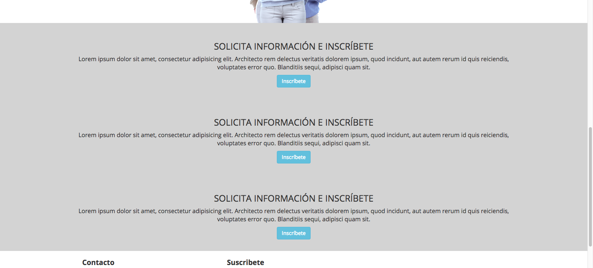
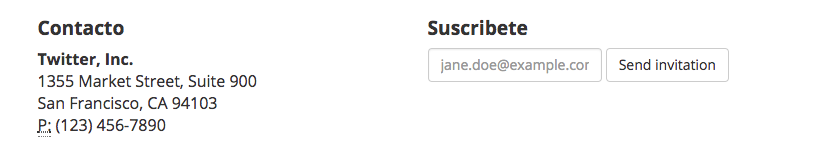

<section>
# Actividad 008 - DOM JQuery

*INSTRUCCIONES*:


Desarrolla los siguientes ejercicios modificando dinámicamente los elementos del landing page, usando todo lo aprendido en clases:

- Luego de terminar la actividad, crea un repositorio con las respuestas en GitHub.
- Finalmente, copia el link del repositorio en la plataforma Empieza.

## Ejercicios:
 
1.	Modifica el título del landing page por *"Transfórmate en desarrollador web"*.
2. Cambia el background de la primera sección presionando el botón *"comienza acá"*.
3. Cambia el logo de *"Desafío Latam"* por el logo de *"en 1 mes"* dinámicamente usando el botón "más info". 
**HINT: Busca el logo dentro de la carpeta img**

4. Copia esta sección y luego pégala debajo de la imagen llamada *"happy-people"*:

 ```html
  <section class="container-fluid seccion-info text-center">
    <h3>SOLICITA INFORMACIÓN E INSCRÍBETE</h3>
    <p>Lorem ipsum dolor sit amet, consectetur adipisicing elit. Architecto rem delectus veritatis dolorem ipsum, quod incidunt, aut autem rerum id quis reiciendis, voluptates error quo. Blanditiis sequi, adipisci quam sit.</p>
    <a href="#" class="btn btn-info btn-carousel">Inscríbete</a>
  </section>
```
Luego, haz que el botón "inscríbete" cree dinámicamente la sección que pegaste anteriormente usando una  función. 
 *Foto de referencia:* 
 
 
- Crea una función constructora que obtenga los datos del correo enviado y que luego muestre una alerta con estos datos.
**Ejemplo: "Tu correo nombre@mail.com ha sido correctamente recibido"**
 
- Crea una condición en los links de la barra de navegación que muestre e identifique qué link fue presionado en el menú mediante una alerta.
- Modifica todos los textos del navbar escribiendo *"Inicio"* en cada uno de ellos utilizando traversing.